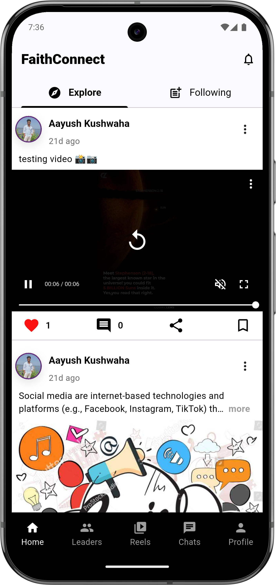
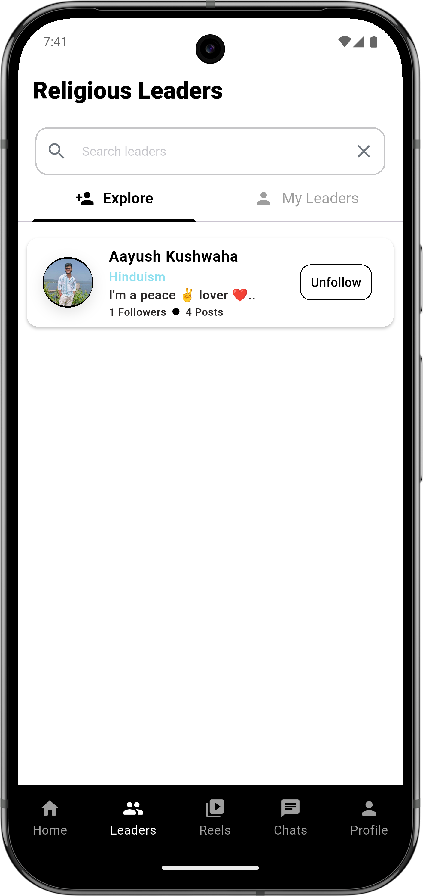
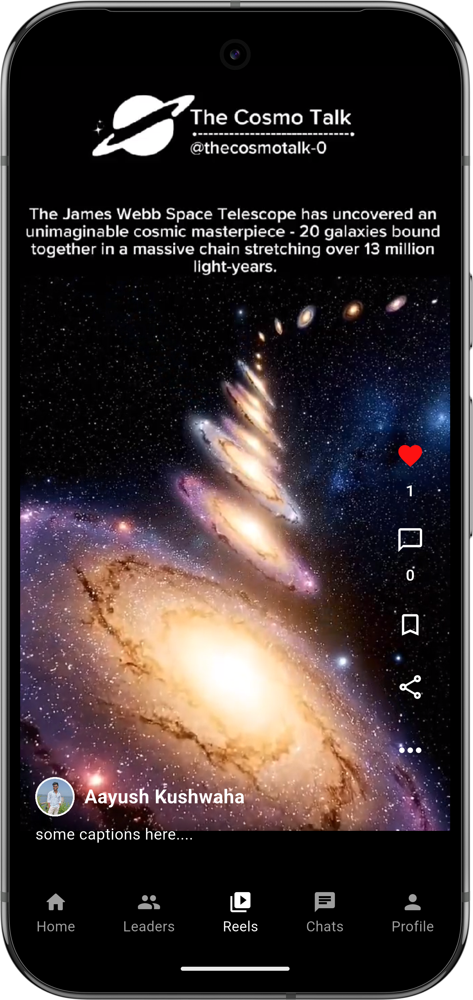
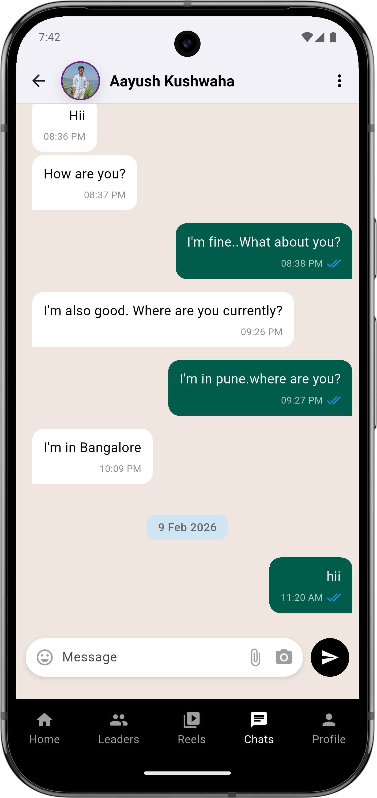
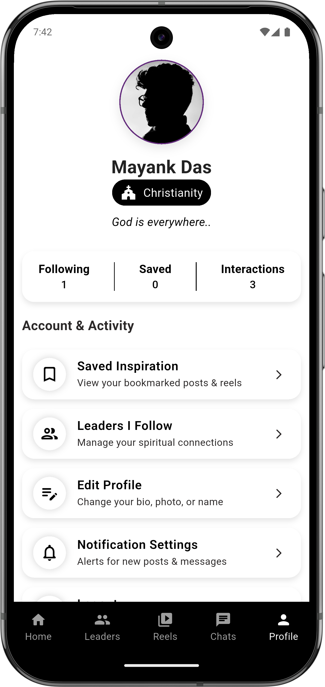
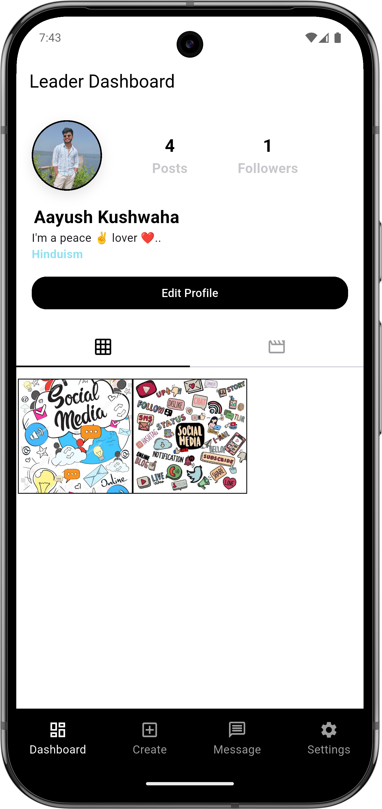
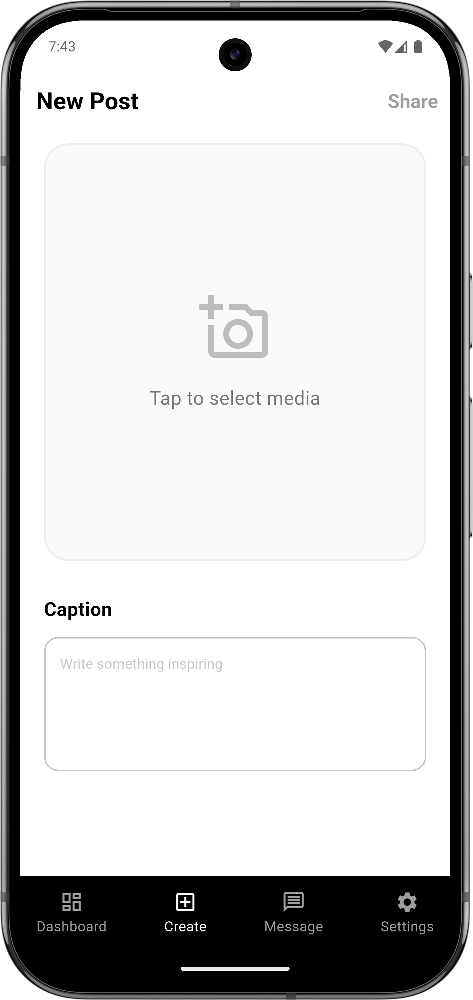
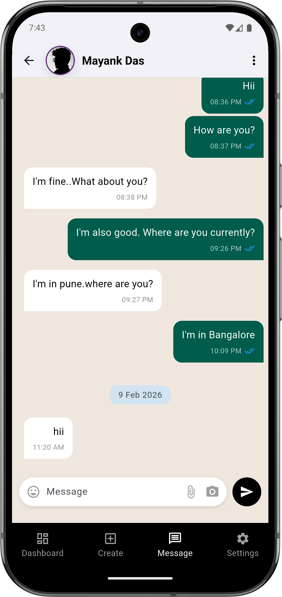
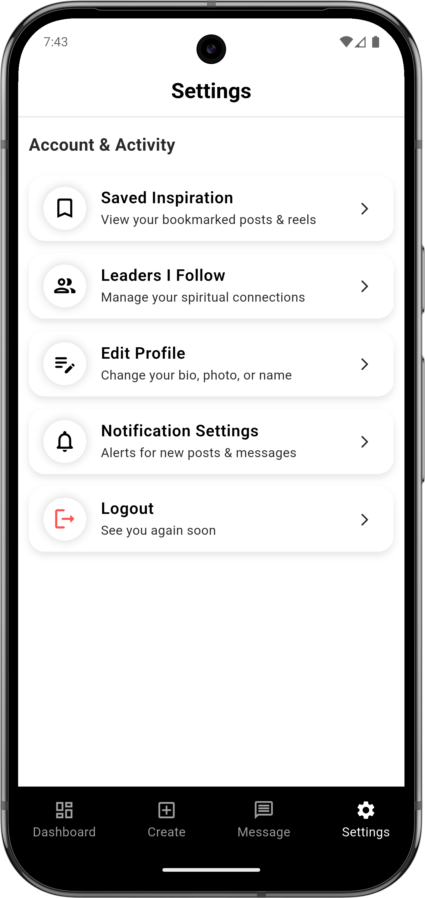

# Faith Connect 📱

FaithConnect is a Flutter-based mobile application designed to 
connect people with verified religious leaders and communities on a single platform. 
The app allows users to discover nearby places of worship, join events, and communicate through real-time chat. 
It provides features like profile management, community interaction, and event participation. 
The application focuses on building harmony, accessibility, and meaningful connections using a clean architecture and BLoC state management.


---

## 📸 App Screenshots

### Worshiper Side View

| Home Feed | Explore Leaders | Reel Screen | Worshiper Chat | Worshiper Profile |
|:---------:|:---------------:|:-----------:|:--------------:|:-----------------:|
|  |  |  |  |  |

### Leader Side View

|                  Leader Dashboard                    |                      Create Post                      |                       Leader Chat                       |                        Settings                         |
|:----------------------------------------------------:|:-----------------------------------------------------:|:-------------------------------------------------------:|:-------------------------------------------------------:|
|  |  |  |  |


---
## 🚀 Key Features

### 🎬 Advanced Video Engine
- **Seamless Reels:** Vertical, snap-scrolling video feed optimized for performance.
- **Unified Audio Control:** Global mute/unmute sync between Home Feed and Reels Feed. Toggling sound in one section intelligently updates the state across the entire app.
- **Smart Preloading:** Implements a **Sliding Window Algorithm** (Preload Next, Cache Current, Dispose Previous) to ensure instant playback without buffering.

### 🤝 Social Interactions
- **Engagement:** Like, Comment, and Save posts capabilities.
- **Profile Management:** View user profiles, posts, and saved content.

---

## 🏗️ Architecture & Tech Stack

This project strictly follows **Clean Architecture** to separate concerns:

- **Presentation Layer:** `flutter_bloc` (Cubit/Bloc) for state management.
- **Domain Layer:** Pure Dart classes (Entities, UseCases, Repository Interfaces).
- **Data Layer:** Repository Implementations, Data Sources, and Models.

## 🛠 Tech Stack
- **Dependency Injection:** `get_it` & `injectable`
- **Video Player:** `better_player_plus` (Customized implementation)
- **Routing:** `go_router`
- **UI Utils:** `flutter_screenutil` (Responsive Design)
- **State Management:** `flutter_bloc` & `cubit`
- **Architecture:** Clean Architecture
- **Connectivity:** `internet_connection_checker_plus`
- **Loading:** `Shimmer Effect`

---

## ⚙️ Configuration & Environment

This project uses **Supabase** for backend services. For security reasons, API keys are not included in the repository.

### Prerequisites
1. Create a project on [Supabase](https://supabase.com/).
2. Navigate to **Project Settings > API** to find your `URL` and `anon public` key.

### Setup Steps
1. Create a file named `.env` in the root directory of the project.
2. Add your Supabase credentials in the following format:

```env
SUPABASE_URL=your_actual_supabase_url_here
SUPABASE_ANON_KEY=your_actual_anon_key_here
```

---

## 📂 Folder Structure
    lib/ 
    ├── core/ # Global utilities 
    │   ├── common/ # Shared Widgets, entities, models 
    │   ├── constants/ # Images, Strings, Storage keys
    │   ├── error/ # Failures & Exceptions 
    │   ├── routes/ # App routes 
    │   ├── services/ # Connection Checker, Media Service, Local Storage
    │   └── theme/ # App Theme 
    ├── features/ # Feature Modules (Auth, Posts, Reels) 
    │   ├── authentication/ 
    │   ├── leaders/ # leader side view
    │   │   ├── data/ 
    │   │   ├── domain/ 
    │   │   └── presentation/ 
    │   ├── onboarding/ 
    │   ├── social_action/ 
    │   ├── splash_screen/ 
    │   └── worshiper/ # worshiper side view
    │       ├── data/
    │       ├── domain/
    │       └── presentation/
    ├── injection_container.dart # Dependency Injection Setup 
    └── main.dart # Entry Point

---

## 🏁 How to Run

1. **Clone the repository:**
   ```bash
   git clone [https://github.com/your-username/faith-connect.git](https://github.com/your-username/faith-connect.git)
    ```  
2. **Install dependencies**
   ```bash
   flutter pub get
   ```

3. **Run the app**
   ```bash
   flutter run
   ```
   
---

## 🧪 APK Build Guide

You can build the APK using the following commands:

-   **Debug APK:**
    ```bash
    flutter build apk --debug
    ```
    *Output path:* `build/app/outputs/flutter-apk/app-debug.apk`

-   **Release APK:**
    ```bash
    flutter build apk --release
    ```
    *Output path:* `build/app/outputs/flutter-apk/app-release.apk`

---

## 📱 App Specifications & Requirements

To build and run this application, ensure your development environment meets the following requirements:

| Platform | Minimum Version            | Target / Recommended      |
| :--- |:---------------------------|:--------------------------|
| **Android** | Android 8.0 (API Level 26) | Android 16 (API Level 36) |
| **iOS** | iOS 12.0                   | Latest iOS                |
| **Flutter SDK** | 3.35.3 or higher           | Stable Channel            |
| **Dart SDK** | 3.9.2 or higher            | -                         |

---

### 🔒 Required Permissions

Since this is a social media application involving media playback and networking, the following permissions are configured:

**Android** (`android/app/src/main/AndroidManifest.xml`)
- `INTERNET`: For fetching data and streaming videos.
- `ACCESS_NETWORK_STATE`: For the global internet connectivity wrapper.
- `READ_MEDIA_VIDEO` / `READ_EXTERNAL_STORAGE`: For uploading/selecting content.

**iOS** (`ios/Runner/Info.plist`)
- `NSPhotoLibraryUsageDescription`: To access the gallery for media uploads.